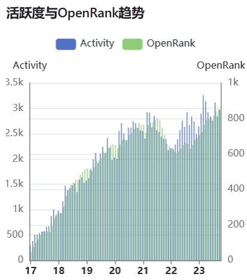
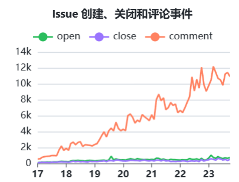
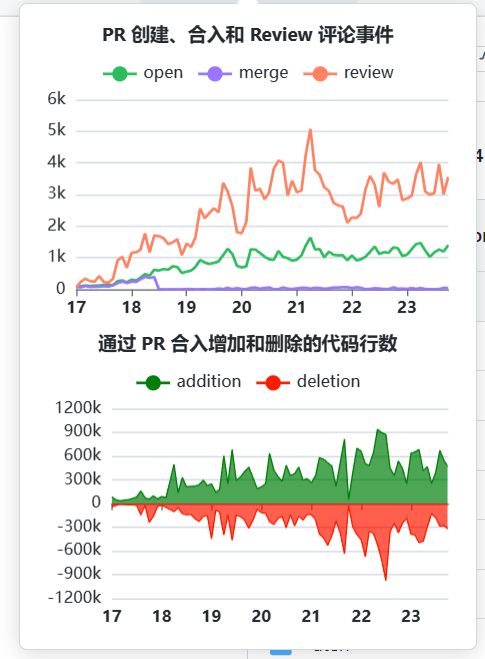
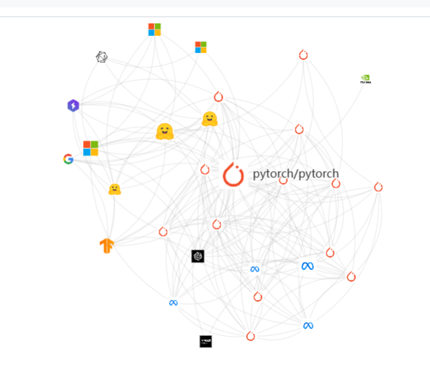
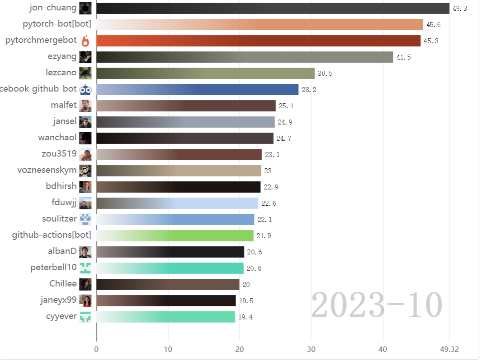
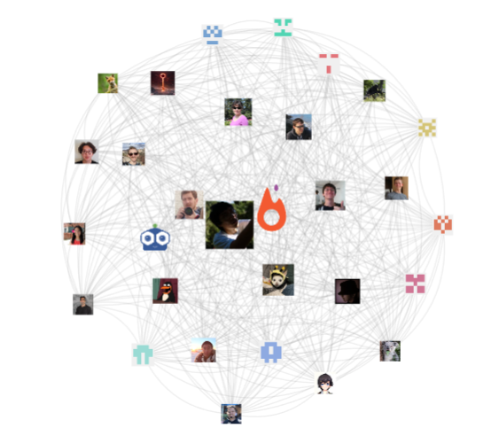

# 使用HyperCRX进行探索pytorch

Hypercrx (发音: 'Hai-puh CRX') 浏览器插件项目旨在通过直接往 GitHub 页面中插入各类可视化看板的形式，帮助用户快速追踪、挖掘和洞察项目与开发者的各类行为数据，为社区的数字化运营和分析提供有效支撑。

因为在数据科学导论这门课上用到了很多的pytorch，所以想来看看它在github上面的一些特征。

可以看到自从pytorch发布就获得了非常高的热度，在之后的几年里面热度也是一直上升，但是在21年逐渐开始有所回落，在22年左右达到局部最低，之后开始复苏。

从有关issue、pr、review有关的数据统计中也可以看到类似的情况。

查询相关的信息，也不知道为什么，猜测可能是因为疫情的影响。

**项目关系网络图**
>项目关系网络图展示了在给定的时间段内，项目与项目之间的联结关系，用于项目间关系的追踪与挖掘。从该网络图中，可以找出与该项目有联结关系的其他项目。
>节点：一个节点表示一个项目，节点大小与颜色的深浅表示项目活跃度的大小。
>边：表示项目与项目之间存在联结关系，值的大小表示项目间联系的紧密程度。为了使网络图不至于太稠密，值小于 5 的边会被剪去。

可以看到一些非常著名的公司，比方说Facebook、Google、NVIDIA、Microsoft，还有很多著名的模型，比方说diffuser、transformer等等，可以看到pytorch的流行程度。

**贡献者有关**
贡献者活跃度:

看了下第一的老哥,在很多与ai有关的项目中都有所贡献

项目活跃开发者写作网络图

>项目活跃开发者协作网络图展示了在给定的时间段内，项目内部活跃的开发者之间的协作关系，用于项目内部开发者关系的追踪与挖掘。从该网络图中，可以找出该项目中最活跃的开发者，及开发者之间的协作关系。
>节点：一个节点表示一个开发者，节点大小与颜色的深浅表示开发者对项目活跃度的贡献值。
>边：开发者与开发者之间的连接关系，值的大小表示开发者间联系的紧密程度。为了使网络图不至于太稠密，值小于 2.5 的边会被剪去。

## 最后
感谢所有开源贡献者