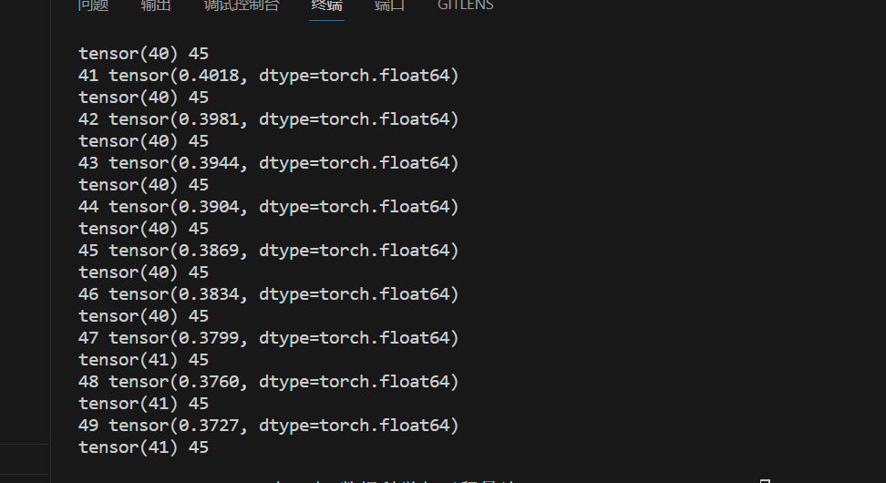
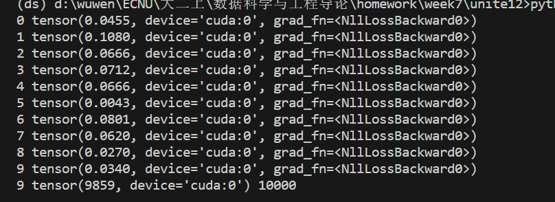

# 第四题的结果

# 第五题的原图是saber.png, 第一小问的结果是grey.png，第二小问的结果是smaller.png

# 第七题和第八题的结果

#### 一些说明第七第八题的代码主要参考了nn_tutorial这份pytorch官方tutorial的代码。然后是通过cuda运行的

# 关于实践题

这个实践题实在是做不了了。主要是因为这个手写汉字数据库官网下载实在是太慢了，快2个g的数据集，下载速度只有50k/s不到，真的等不动了
